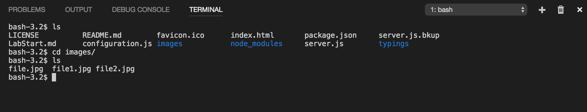
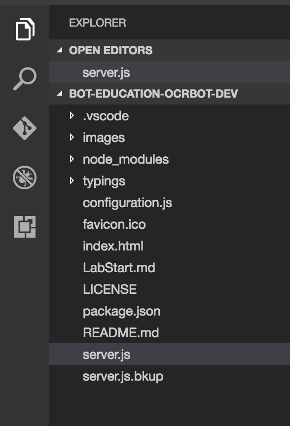

# Introduction to conversational apps

## Your Mission

In `Dialogs.md` you will learn about dialog handling and logic.

`Recognizers.md` leads you down a path of building recognizers to intelligently pick up the intents of our clients.

### Prerequisites

Ensure you have fufilled those listed on the main [README](../README.md) for this course.

### Environment and setup

Make a new folder for your bot. All your bot's code will be stored in this folder. Next, open up your command prompt and navigate to your bot's folder using `cd`. Refer to [this link](http://www.wikihow.com/Change-Directories-in-Command-Prompt) if you're not sure how to do this. Mine ends up looking something like this:



Now run `npm init` to start your nodejs project. They'll fill in some fields for you by default, you can keep pressing enter. You can enter the description for your bot and author name (as I have done) if you'd like, but it's ok to leave them blank too. 

If you check your bot's folder now, there should be a `package.json` file. [package.json](https://docs.npmjs.com/files/package.json) is like a description of the project, such as which packages our node project uses. It does other useful stuff too that we don't need for this tutorial. Now run the following 2 commands separately in the command line to install the `botbuilder` and `restify` packages (each of the packages may take a while to finish installing):

```shell
npm install --save botbuilder@3.6.0
npm install --save restify@4.3.0
```

Packages (or dependencies) are like parts/modules that others have written which we can use to build our bot. Microsoft's [BotBuilder](https://www.npmjs.com/package/botbuilder) is a framework we use to build our bot by handling stuff such as dialogs and storing info about the user. [Restify](https://www.npmjs.com/package/restify) exposes our bot through an API so that other web services can talk to it. The `--save` flag automatically updates the `package.json` file to show that BotBuilder and Restify are dependencies in our project.

Open up Visual Studio Code. Go to File > Open Folder... and select your bot's folder. You should be able to see your file structure on the left panel, it'll look something like this:



 The `node_modules` folder contains all the packages needed in our project. If you look into the folder, you'll see more than just BotBuilder and Restify - that's because they require other packages to work as well. Right click the left panel area and create a new file. Name it `server.js`.

You will use be copying code snippets into a `server.js` (and will reference it as such here) to build your bot.  Note: you can name this file  whatever you want like `catsarebetterthandogs.js` (for good reasons you'll see it as `server.js` or `app.js` however so we'll stick with one of those).

## Testing Locally

When going through the exercises and piecing together your code, you will test it in this manner:

3.  Open the folder, where your newly created package.json exists for each mission, in VSCode.
3.  You can start the process in the command terminal (you can use VSCode's integrated terminal under the "View" menu option) and type into the commmand prompt or Integrated Terminal in VSCode (under View) to begin running the server behind our bot:
  - `node server.js`
  
  > Doesn't work? Windows not able to find the node command?  First make sure you've run `npm install` as described above.  Try adding `NODE_PATH` as a System variable in the Advanced tab of the System Properties dialog and set to the path `%AppData%\npm\node_modules` (Windows 7/8/10) or wherever npm was installed.  Also, check you have run `npm init` and `npm install...` to get the modules needed.
  
6.  Open the botemulator desktop app (you can find this under botframework-emulator) and do the following:
    * Click in the empty space asking for an Endpoint URL at the top and some choices should pop up
    * Select app on port (usually 3978)
    * Keep app id and app password blank
    * Hit connect


Go ahead and type a message in the chatbox at the bottom and send it. The bot should respond 'Hello World' for the first exercise every time you send it a message. If you look back at the command line, you'll be able to see some info on what's being called. Note that if there are any errors, you'll be able to see the error in the command line as well which helps with debugging. 

Press `Ctrl + c` in the command line when you're done talking to the bot and this will shut down our `restify` server.

More info on connecting to a bot on localhost [here](https://github.com/microsoft/botframework-emulator/wiki/Getting-Started#connect-to-a-bot-running-on-localhost)


